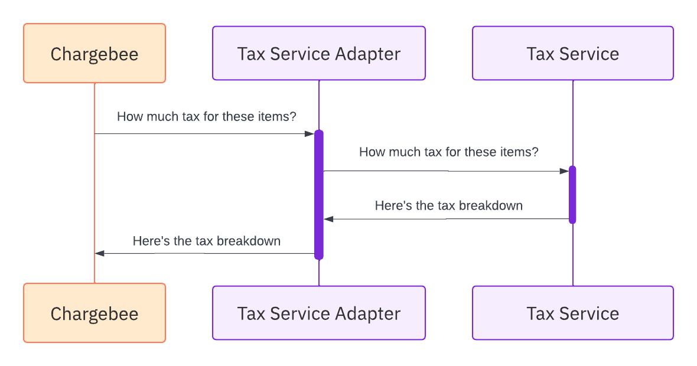

# Overview of Tax SPI Integration

To streamline tax management during checkout sessions and invoice creation, Chargebee performs several key operations, including:

### 1. Validation of Customer Shipping Addresses
Ensuring shipping addresses are valid for accurate tax calculation and product delivery.

### 2. Tax Estimation
Calculating applicable taxes for invoices and their line items.

### 3. Tax Reconciliation
Submitting invoice and credit note data to external systems for tax reconciliation.

Chargebee leverages external tax services to execute these operations effectively. These services can be categorized as:

- **Third-Party Tax Service Providers:**  
  Offering APIs for tax calculation and reconciliation.

- **Merchant's In-House Tax Software:**  
  Custom-built solutions used for managing taxes internally.

## The Role of the Tax Service Adapter

To connect with external tax services, Chargebee requires a tax service adapter—a bridge facilitating seamless communication between Chargebee and the tax service. This connection is established using the **Tax Service Provider Interface (SPI)**.

## Building a Tax Service Adapter

To integrate a tax service with Chargebee, you must implement the Tax SPI by developing a tax service adapter app. This is essential for one of the following scenarios:

- **As a Tax Service Provider:**  
  Integrate your tax service with Chargebee to offer seamless tax calculation capabilities to merchants.

- **As a Merchant:**  
  Connect your in-house tax software to Chargebee for tailored tax management.

- **As a System Integrator:**  
  Build a connector that bridges a tax service provider with Chargebee, enabling integration for merchants.

By implementing the Tax SPI, you enable Chargebee to perform tax-related operations efficiently while ensuring accurate compliance and streamlined workflows.

